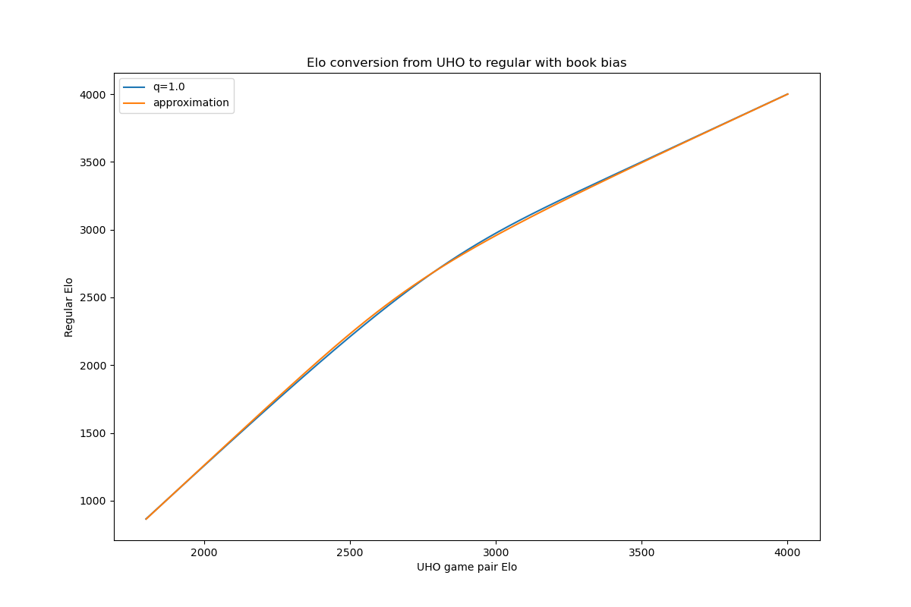

GM Matthew Sadler has posted a [blog post](https://matthewsadler.me.uk/openings/online-chess-novelties/) on WDL Contempt and a series of YouTube videos showing examples of using it for opening preparation.
<!--more-->

1. [Introducing Crazy Leela’s GROB Semi Slav! Part 1](https://www.youtube.com/watch?v=u9i71vdm_Ew)
2. [Introducing Crazy Leela’s GROB Semi Slav! Part 2](https://www.youtube.com/watch?v=EK9_iA63Nvo)
3. [Crazy Leela’s Anti-Sveshnikov! Leela WDL Contempt Part 3](https://www.youtube.com/watch?v=9KjHtK9Ka4U)
4. [Crazy Leela and Petrosian take on Gawain's KID! Leela WDL Contempt Part 4](https://www.youtube.com/watch?v=P6uDOWiesTA)
5. [Crazy Leela and Petrosian take on Kotronias's KID! Leela WDL Contempt Part 5](https://www.youtube.com/watch?v=oLjkvfsgzlo)
6. [Great Engine Games! Crazy Leela crushes the Caro-Kann! Leela WDL Contempt Part 6](https://www.youtube.com/watch?v=C5j6qjyY0MA)
7. [Crazy Leela storms the Caro-Kann! Leela WDL Contempt Part 7](https://www.youtube.com/watch?v=XpsYVOR1g88)
8. [Crazy Leela hunts the Sicilian Najdorf with 6.Bg5! Leela WDL Contempt Part 8](https://www.youtube.com/watch?v=SLm5Fo3cWZM)
9. [More Crazy Leela hunting in the 6.Bg5 Sicilian Najdorf! Leela WDL Contempt Part 9](https://www.youtube.com/watch?v=Kr0xvrTqQw4)
10. [Crazy Leela against Giri in the 6.Bg5 Sicilian Najdorf! Leela WDL Contempt Part 10](https://www.youtube.com/watch?v=-pBJn-5KYGs)

We are very happy with both the content and the entertaining presentation. If it inspires you to try it out for yourself, we have a few recommendations on how to set things up to get the desired results.

The upcoming v0.31.0 Lc0 release will include two improvements to the WDL Contempt feature, making the estimated Win/Draw/Loss estimates more realistic at the respective level, and thus the chosen lines more realistic as well.

1. A bug was fixed which accidentally reduced the amount of contempt for nets with naturally higher draw rate.
2. The underlying (UHO) Elo model is designed to work well with the challenges of high level engine chess.

To elaborate on the second point above, high level engine chess (playing game pairs from nearly decisive opening positions), has led to a stark discrepancy to regular Elo below 2800 Elo. The following figure shows the conversion from regular Elo to UHO Elo.

If you for example wanted to simulate the play between 2700 and 2300, with the Lc0 v0.30 release you would need to use 2750 and 2550. In most cases, using the old version will overestimate the Elo difference and underestimate the overall accuracy of both players by a significant amount. Furthermore, using ratings below 2200 became totally unreasonable, while the v0.31.0 version allows ratings as low as 1500.

GM Sadler's video series used Lc0 v0.30 with 2700 vs 2300 and attenuation 0.5, which is roughly equivalent to 2300 vs 1950 with the corrected Elo model and attenuation 1.0, so probably quite a bit more than originally intended.
Nonetheless, even if the suggestions at more extreme settings won't be sound if played at the highest level, they usually aren't just unconventional, but justified to some extent, and definitely interesting and entertaining.

You can also find some examples from a recent TCEC bonus where Leela with deliberately too high Contempt played common main lines against a selection of top 40 (but outside the top 10) engines rated between 3300 and 3500 in the TCEC rating list in the [TCEC archive](https://tcec-chess.com/#div=contemptla&game=1&season=26).

Suggested use for opening research (with the v0.31.0 version):
- ContemptMode: white_side_analysis or black_side_analysis deciding the perspective for analysis, or play if you use "play against the engine" in your GUI
- Use that side's Elo and the Elo difference from that side's perspective as WDLCalibrationElo and contempt, while adding approx. 50 Elo to WDLCalibrationElo per doubled thinking time from 3'+2"
- WDLEvalObjectivity: 0.0 and WDLContemptAttenuation: 1.0 if you want to get realistic WDL at the specific matchup and suitable lines (also recommended for kibitzing games)
- WDLEvalObjectivity: 1.0 and WDLContemptAttenuation between 0 and 1 if you want to simulate different levels of aggressiveness but still get the objective eval of the chosen lines
- Set WDLDrawRateReference to the respective value for the NN, i.e. the initial draw rate at default settings.
- MovesLeftThreshold: 0.95 if you want to experiment with more extreme Contempt values above 250.
- Try to run Leela for at least 10k nodes to make sure that the selected lines aren't just the usual main lines from Leela's policy output.

A few clarifications on possible misconceptions:
- Setting WDLCalibrationElo doesn't reduce the playing strength to the respective level, it just simulates the WDL at the specific level. Search will still be able to find tactics well beyond the specific playing level.
- WDLDrawRateReference depends on the NN you use, and is needed for the Elo model to be accurate. You can determine which value to use by looking at the estimated D at default settings; common values are 0.65 (recent T80 nets), 0.62 (BT4, t2, older T80 nets), 0.47 (T79, T75), 0.43 (T74).
- WDLCalibrationElo not only decides the overall accuracy (and therefore the draw rate from startpos), it also affects how strongly Contempt influences the evaluations and suggested lines, where the same Contempt (Elo difference) will have less effect at higher WDLCalibrationElo.
- The quotation marks (&#x0022;) around the names and values of options in Nibbler's engines.json file have to be the plain ones you can type from your keyboard, not the fancy curly ones like &#x201F;here&#x201D;.
- The WDL feature itself, changing Lc0's output to predict Win/Draw/Loss chances instead of just an expected value, was introduced in v0.21 (Feb 2019). The Contempt implementation added to Lc0 in v0.30 works based on WDL, which makes it unique and very different from other engines' Contempt implementation, since they don't have a natural WDL output.
