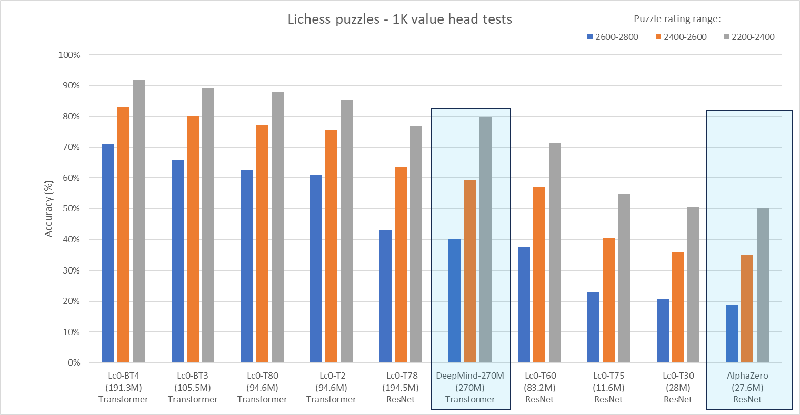
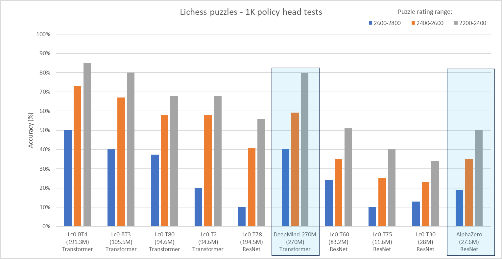

To explore the performance of Lc0 networks relative to DeepMind's state-of-the-art transformer networks, we embarked on a comparative analysis, inspired by the methodologies detailed in DeepMind's [latest publication](https://arxiv.org/abs/2402.04494). Our objective was to closely align our testing approach for Lc0 networks with the evaluation framework applied by DeepMind, allowing for a direct comparison of results.

<!--more-->

#### Approach and Methodology

For Leela’s own networks we conducted 1000 tests on Lichess puzzles using EngineBattle[^1]. The main methodology used mirrors that in the paper, which evaluates the value network understanding of the puzzle position without search. For DeepMind networks we extracted the puzzle accuracy scores from DeepMind’s article (Figure 2). We concentrated on evaluating the performance of our neural networks by testing them on a subset of Lichess puzzles, specifically focusing on puzzles with difficulty ratings between 2200 and 2800.

To solve a puzzle, every move in a move sequence needs to be correct, except for mates in one where there could be more than one solution. So, any move that checkmates should win the puzzle. Some puzzles could be a long sequence of moves (like 8 only moves) and other puzzles could be much simpler (like mate in 4).

#### Value network test

For value head test, you need to check the evaluation of every legal move in the position and pick the one with the highest evaluation. This is executed with the UCI-command “go nodes 1” for every legal move and then extract the network value for this move. Finally, you need to pick the move with lowest value for the player in turn since you would like to get the best move from the previous position. This is exactly how DeepMind did their own value-network test of Lichess puzzles according to the paper. EngineBattle automates this rather time-consuming process of testing the performance of different nets against each other and makes it easy to create a selection of puzzles based on: number of puzzles, rating interval, engine/network filter and puzzle theme (endgame, middlegame, etc.) in the test. Since we wanted to mirror the DeepMind methodology we did not filter for any theme in this comparison.

#### Policy network test

To evaluate the policy network, we ask the neural net for the top policy move for a given puzzle position and compare it to the solution and if all moves in a puzzle sequence are top-policy moves then the puzzle is solved. In this test we are not able to compare directly with DeepMind since they did not provide a policy-head accuracy test for their networks.
To gauge the effectiveness of our models, we employed a metric called "puzzle accuracy," which we define as the percentage of instances where the model's proposed sequence of moves precisely matched the puzzle's correct solution sequence.

#### Comparison 1 – value network

We created a comparison chart that evaluates the value network of various Lc0 networks, AlphaZero, and the latest 270M-parameter network from DeepMind.

As you can see from the chart, the latest Lc0 networks are significantly stronger than the latest BIG transformer network from DeepMind (270M) and AlphaZero accuracy score is about the same as our T30 net which in fact is based on the same architecture as AlphaZero.

#### Comparison 2 – policy network

We finally created a comparison chart that evaluates the policy network accuracy of the same networks. We kept the value network test of DeepMind’s networks in this comparison chart for convenience – they are not strictly comparable. In general, a puzzle test performance based on value is typically about 150 Elo stronger than a policy test (but quite a bit slower).

As you can see from the chart, the latest BT4 network[^2] is stronger in policy accuracy than the best transformer network from DeepMind is in value accuracy. The improvement in accuracy with the latest transformer networks has been steadily improving with the size of the model.

[^1]: EngineBattle is a chess GUI/tool with added Lc0 features that is under development by one of the members of our community and will be released as open source in the near future.

[^2]: The network architecture of BT3 and BT4 allows for several different policy heads, the "optimistic" one is used for this test.
