Recently, the [transformer architecture](https://arxiv.org/abs/1706.03762) has dominated domains as diverse as vision and natural language processing. Over the past two years, the Lc0 team has been trying to answer the following question:

   *What chess-specific enhancements can be made to the transformer architecture?*
<!--more-->

#### Our work
Leela’s nets have historically struggled with long-range dependencies, failing to recognize positional and tactical ideas involving squares that are far away from each other, such as multiloaded pieces. This was because Leela’s models used a convolution-based architecture, like those of the DeepMind AlphaZero project on which Lc0 is based. Effectively, each square iteratively analyzes the information at each adjacent square and uses that information to refine its representation. The main drawback of this approach is the small receptive fields of the convolution filters. For the a1 square to “learn” about what piece is on h8, the information must make at least 7 trips from square to square.

Our strongest transformer model, BT4, is nearly 300 elo stronger in terms of raw policy than our strongest convolution-based model, T78, with fewer parameters and less computation. We've tested dozens of modifications to get our transformer architecture to where it is today.

All of our experiments used a Post-LayerNorm encoder-only architecture with [DeepNet](https://arxiv.org/abs/2203.00555) initialization. Our models use 64 tokens, one for each square. The order of the tokens is flipped with the side to move, and we use mish nonlinearities in the FFN layers. Embeddings are formed as a linear projections of an input consisting of:

 * 8 one-hot vectors of dimension 12 describing the piece at that square for the current ply and last 7 plies
 * En passant and castling information
 * The rule 50 count
 * Whether each of the current and last 7 plies is a repetition

We also include a learnable positional embedding.

#### Positional Encodings and Smolgen

One significant improvement in transformers across domains is the alteration of self-attention to downweigh connections between tokens which are far away from each other. The dot-product metric is effective at detecting semantic information but can struggle with positional information. Techniques like [RoPE](https://arxiv.org/abs/2104.09864) and [relative positional encodings](https://arxiv.org/abs/1803.02155) in NLP address this issue by allowing models to decay the weight between distant tokens. Similar techniques in two dimensions have been applied to [vision](https://arxiv.org/abs/2107.14222). One can imagine the tokens in the respective domains as being embedded in a “topology” whose structure roughly translates to Euclidean 1- and 2-space. Under this view, tokens must be compared both semantically and positionally, with dot-product attention addressing semantic relationships and positional embeddings addressing positional relationships.

Our primary success hinged on viewing the chess board as a unique topology in which the idea of distance is based on attributes of chess rather than Euclidean distance. Squares which are a knight’s, rook’s or bishop’s move away from each other can be viewed as tied closely together even if they are far apart on the board. One advantage of having the tokens corresponding to the squares, rather than say as characters in a fen, is that the positional relationships between them are fixed. To allow the model to encode this information, our first iteration added a trainable bias to attention logits before the softmax, for a total of 64&times;64&times;h additional parameters per layer, where h is the head count. This allows the model to play as if 50% larger with a negligible loss in throughput.

Our second improvement stemmed from the idea that if the semantic relationships modeled with dot-product attention are dynamic then the positional information should be as well. In a closed position, squares that are far apart should have the signal between them constrained, while in an open position the signal between those squares should be amplified. The main idea is:

 1.	Compress the current representation of the position into a small vector.
 2.	For each head, generate a supplemental set of attention logits to add to those generated by dot-product attention before the softmax.

To accomplish 1., we apply a linear projection to the tokens to form 64 vectors of length 32, flatten this into a vector of size 64&times;32, and apply another dense layer to extract a vector of size 256. For 2., we apply a linear projection to form a vector of size 256 for each head, then for each head we use a 256&times;4096 linear projection shared across the whole model to generate the final supplemental attention logits. Note that this description omits normalization layers and biases, and the hidden sizes reported vary with model scale. This module, which we call "smolgen", allows the model to play as if it were an additional 50% larger with only a 10% reduction in throughput.

#### Other improvements

Another unique aspect of transformers in chess is that they don’t seem to benefit from large FFN sizes. We found very little performance gain from increasing the expansion ratio from 1&times; to the ratio of 4&times; typically used in vision and NLP. We also found that our models do best with small head depths. With smolgen enabled, we found improvement up to a head depth of 8. This may be because there are so few tokens in chess relative to other domains. Despite this, BT3 and BT4 use heads of depth 32 since training is significantly slowed by large head counts.

Our last enhancement was a minor upgrade to the embedding. Qualitative analysis of the attention maps in the first attention layer suggested that it was not doing much. To address this, before the token embedding we flatten the 12&times;64 board representation (64 one-hot vectors of length 12 corresponding to which piece is at each square) and for each square apply a linear projection to C channels, which we concatenate to the input before the token embedding. We also add an FFN layer after the embedding so the model can make use of this information. The goal is to allow the model to encode the entire board state from the beginning. While parameter inefficient, this new embedding lets the model play as if 15% larger with a 5% latency increase.

Another change which should speed up inference is omitting biases in the QKV projection and omitting centering and biasing in normalization layers, except those in smolgen. This will make training 10% faster and inference 5% faster without quality degradiation, but will only be introduced in BT5.

These enhancements to the architecture have vastly improved Leela’s playing strength. The raw policy of BT4 is 270 Elo stronger than that of T78, our strongest convolution-based model, with fewer parameters and computations. We’ve also closed much of the performance gap with Stockfish. At the TCEC Superfinal [Season 23](https://tcec-chess.com/#div=sf&game=1&season=23) Leela lost 19 game pairs and only won 2, while in Seasons [24](https://tcec-chess.com/#div=sf&game=1&season=24) and [25](https://tcec-chess.com/#div=sf&game=1&season=25) she lost 9 and won 5.

#### Attention Maps

As discussed above, smolgen allows chess transformers to utilize self-attention much more effectively. We can gain insight into how the enhanced self-attention layers work by looking directly at the attention maps. We visualized the attention maps of BT4 using j33's excellent [visualization tool](https://github.com/Ergodice/lc0-attention-visualizer/). The highlighted square is the one producing the queries, i.e., receiving signal, and the other squares are colored based on the strength of the signal traveling from that square to the querying square.

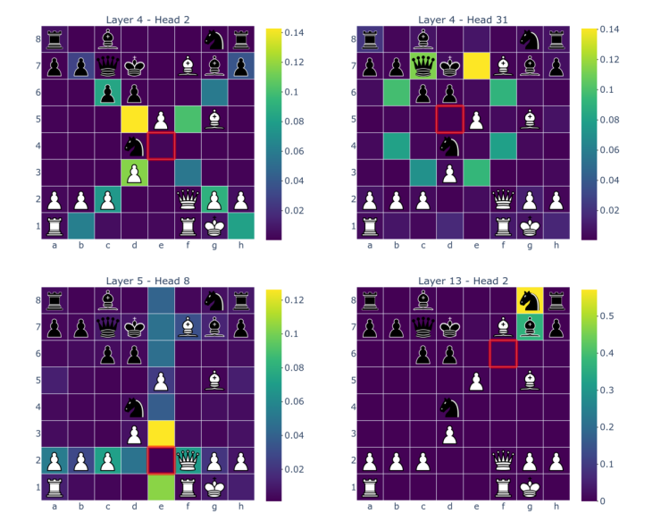

The attention maps above are from heads in layers 4, 4, 5, and 13, respectively. As can be seen from the figure, the majority of the heads correspond to the move type of a specific piece: rooks, bishops, knights, pawns, and kings. The attention weights aren't uniform over a select group of squares but tend to decay as distance from the querying square grows.  The fourth attention map is particularly interesting because it detects which of the opponent's pieces can move to a square. The model learns this from scratch just from the gradient signal; the only human intervention is in the architecture choice. The model isn't perfect though! Here is an attention map taken from a head in layer 10:

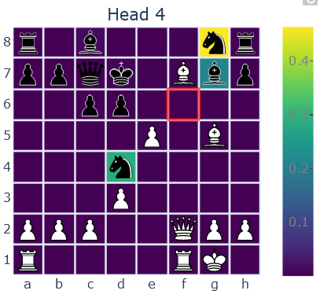

This head also looks at which of the opponent's pieces can move to a square, but in this case the model seems to mistakenly think the knight on d4 can move to f6! This may be a consequence of the way this head functions. We believe it relies on a heuristic, attending to squares which

* Are a knight's, rook's, or bishop's move away
* Have a piece type which the token at the querying square knows can move there

In this example, the token corresponding to f6 knows that there is a black knight and black bishop which can move to that square, so it attends to black knights and bishops which are rook's, bishop's, or knight's move away. This heuristic may work most of the time, but it fails in situations like these.

We've also noticed a strange tendency for squares in later layers to consistently attend to a seemingly arbitrary set of squares across attention heads. In [layer 12](#layer-12-heads), squares in around half the heads are attending to b2, b4, and a3. One possibility is that these squares act as a global information bottleneck, storing global information about the board and relaying it to other squares. 

#### Model Progress

Here is a short summary of our timeline of progress. BT1 was our first transformer model, performing roughly on par with T78, our strongest convolution-based model. BT2 improved on BT1 by adding smolgen and increasing head count. BT3 further improved on BT2 by increasing head count again and adding the new embedding layer. BT4 built on BT3 by doubling model size to push our architecture to the limit. In the figures below, "params" refers to the parameter count of a model and "FLOPS" refers to the number of floating point operations it uses per position. 270M is a transformer model trained recently on chess fens and without domain-specific improvements [by DeepMind](https://arxiv.org/abs/2402.04494). Policy elo for that model is estimated based on performance in chess puzzles.

| model      | Params (M) | FLOPS (G) | Policy Elo | Date |
|--------------|------------|-----------|--------| -|
|T78 | 194.5 | 12.45 | &emsp;&ensp;- | 12/2021 |
|BT1 | &ensp;92 | &ensp;5.637 | &ensp;+13 | &ensp;8/2022 |
|BT2 | &ensp;82 | &ensp;3.964 | +123 | &ensp;3/2023 |
|BT3 | 105.5 | &ensp;4.158 | +179 | 10/2023 |
|BT4 | 191.3 | &ensp;7.613 | +270 | &ensp;2/2024 |

|  | BT1      | BT2  | BT3 | BT4 |
|--------------|------------|-----------|--------|-|
|Layers|  12 | 15| 15| 15|
|Embedding size| 1024 | 768 | 768 | 1024 |
|FFN size| 1536| 1024|1024|1536|
|Head count| 8| 12| 24| 32|
|Smolgen| &cross;| &check;| &check;| &check;|
|New embedding| &cross;|&cross;| &check;| &check;|

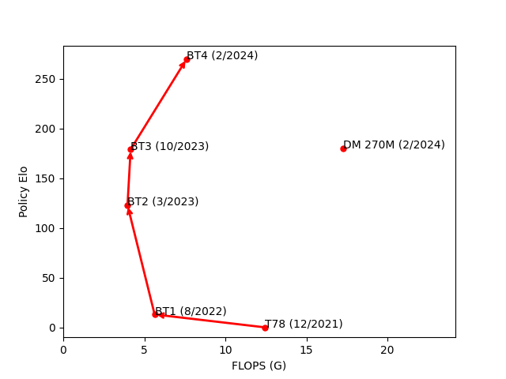
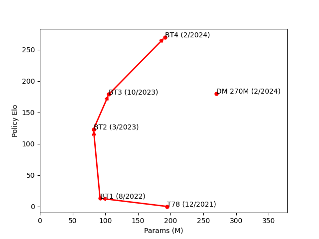

#### Future Work
The future of Leela is bright. Early experiments with [relative positional encodings](https://arxiv.org/abs/1803.02155) show that our architecture still has plenty of room for improvement. Also, we're finally having success with [INT8 quantization](https://arxiv.org/abs/2402.05628), which could speed up our models by 50% without quality degradation.

#### Wrapping Up

A lot of techniques which have been successful in other domains did not bear fruit for us. For example, [MoE](https://arxiv.org/abs/1701.06538), which only activates part of the FFN for each token, and [GLU](https://arxiv.org/abs/2002.05202), which takes the product of two activated linear projections in computing the FFN hidden state, did not noticeably improve performance. We suspect that this is because chess transformers do not rely much on the FFN sublayer.

As always, Lc0 is based on contributions from volunteers who want to push forward the state of the art in computer chess. If you have any insight or ideas to share, we are happy to speak in our [Discord chat](https://discord.gg/pKujYxD).

#### Architecture Diagrams

A big thank you to Almaudoh for designing these!

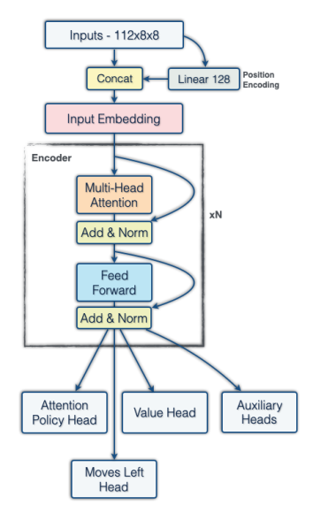
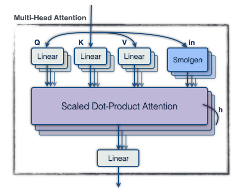
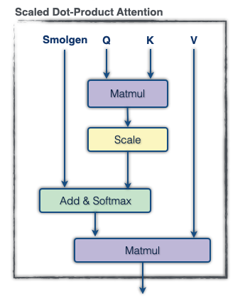
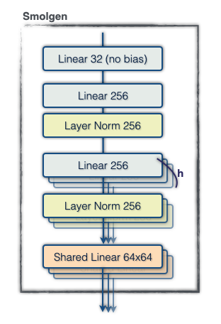
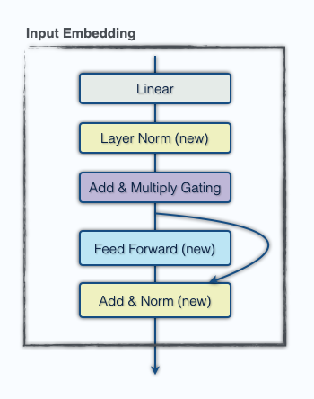

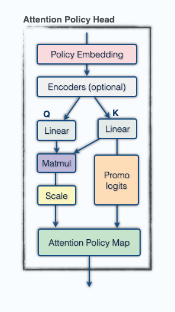

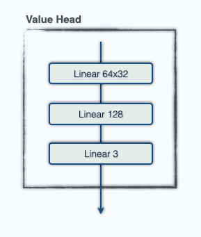
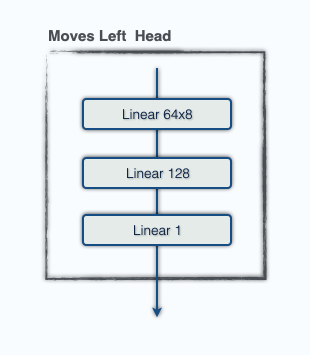

#### Layer 12 Heads
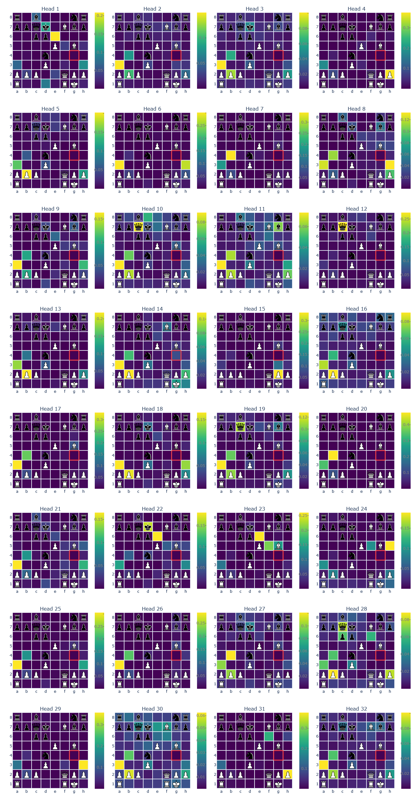
