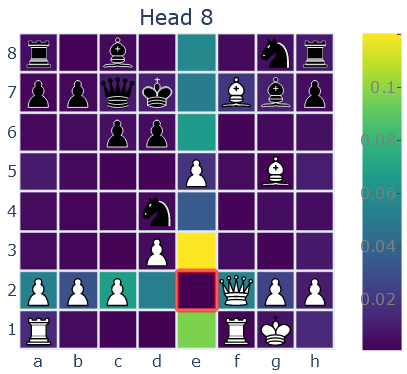

The transformer architecture has dominated domains as diverse as vision and language perception recently. Over the past two years, the Lc0 team has been trying to answer the following question:

   *What chess-specific enhancements can be made to the transformer architecture?*
<!--more-->

Leela’s nets have historically struggled with long-range dependencies, failing to recognizing positional and tactical ideas involving squares that are far away from each other, like multiloaded pieces. This was because Leela’s networks used a convolution-based architecture, like those used in the DeepMind AlphaZero project on which Lc0 is based. Effectively, each square iteratively analyzes the information at each adjacent square and uses that information to refine its representation. The main drawback of this approach is the small receptive fields of the convolution filters. For the a1 square to “learn” about what piece is on at h8, the information must make at least 7 trips from square to square.

#### Our work

All of our experiments were encoder-only with a Post-LayerNorm architecture. We use 64 tokens, one for each square. The order of the tokens is flipped with the side to move. Most of our initial experiments used 10 layers with embedding size 256 and 8 heads, and a 4&times;DFF expansion ratio, with mish nonlinearities in the FFN layers. The embeddings were formed as linear projections from an input consisting of:

 * 8 one-hot vectors of dimension 12 describing the piece at that square for the current ply and past 7 plies
 * En passant and castling information
 * The rule 50 count
 * Whether each of the past 8 plies is a repetition

We also include a learnable positional embedding for each square on the board.

#### Positional Encodings and Smolgen

A major respect which transformers have been improved in other domains is in altering the attention weights to downweigh connections between tokens which are far away from each other. The dot-product metric can struggle to detect nearby tokens. Techniques like [RoPE](https://arxiv.org/abs/2104.09864) and [relative positional encodings](https://arxiv.org/pdf/1803.02155.pdf) in NLP addressed this issue by allowing models to decay the weight between distant tokens. Similar techniques in two dimensions have been applied to vision. One can imagine the tokens in the respective domains as being embedded in a “topology” whose structure roughly translates to Euclidean 1- and 2-space. Tokens can be viewed as having both “semantic” and “positional” information, with dot-product  attention addressing the semantic component and positional embeddings addressing the positional component.

Our main success relied on viewing the chess board as a special topology in which the idea of distance is focused on attributes of chess rather than Euclidean distance. Squares which are a knight’s, rook’s or bishop’s move away from each other can be viewed as tied closely together even if they are far apart on the board. One advantage of having the tokens corresponding to squares on a chessboard rather than characters in a fen is that the positional relationships between them are fixed. To allow the model to encode this information, our first iteration added a trainable bias to attention logits before the softmax, for a total of 64&times;64&times;h additional parameters per layer, where h is the head count. This allowed the model to play as if 50% larger.

Our second improvement came from the idea that if the semantic relationships modeled with dot-product attention are dynamic then the positional information should be too. In a closed position, squares that are far apart should have the signal between them constrained while in an open position the signal between those squares should open up. The main idea is:

 1.	Compress the current representation of the position into a small vector 
 2.	For each head, generate a supplemental set of attention logits to add to those generated by dot-product attention before the softmax.

To accomplish 1., we apply a linear projection to form a vector of length 32 per square, then flatten this into a vector of size 64&times;32, then apply another dense layer to extract a vector of size 256. For 2. we apply a linear projection to form a vector of size 256 for each head, then for each head we use a 256&times;4096 linear projection shared across the entire model to generate the final supplemental attention logits. Note that this description omits layer normalizations and biases, and the hidden sizes vary with model sizes. This module, which we call **smolgen**, allows the model to play as if it were an additional 50% larger with a ~15% decrease in throughput.

With smolgen the attention maps have become much clearer. We have observed attention maps (with j33’s excellent visualization tool, a fork supporting newer models can be found [here](https://github.com/Ergodice/lc0-attention-visualizer/)) corresponding to the move type of each piece, as well as heads which for each square attend to squares with pieces that can move to that square, heads which attend to the queens, and heads which attend to all of the opponent’s pieces. Viewing the smolgen and cosine similarity logits separately confirms that smolgen focuses on positional relationships while the dot product logits don’t encode this information.

#### Other improvements

The next peculiarity of transformers in chess that we found is that they don’t seem to benefit much from large FFN sizes. We found very little improvement between an expansion ratio of 1 and an expansion ratio of 4 typically used in vision and NLP. We also found that our models do best with small head depths. With smolgen enabled, we found improvement up to a depth of 8. This may be because there are so few tokens relative to other domains. Despite this, BT3 and BT4 use heads of depth 32 since self-attention can be an expensive operation with enough heads.

Our final improvement was a minor upgrade to the embedding. Qualitative analysis of the attention maps in the first attention layer suggested that the attention layer was not doing much. To address this, at the token embedding we flatten the 12&times;64 board representation (64 one-hot vectors of length 12 corresponding to which piece is at each square) and for each square apply a linear projection to C channels, which we concatenate to the input before the token embedding. We also add an FFN layer after the embedding so the model can make use of this information. The goal is to allow the model to encode the entire board state from the embedding. While parameter inefficient, this lets the model play as if 15% larger with around a 5% latency increase.

Another change which should speed up inference is omitting biases in the QKV projection and omitting centering and biasing in normalization layers, except in smolgen. This should make training 10% faster and inference 5% faster but will only be introduced in BT5.

These enhancements to the architecture have vastly improved Leela’s playing strength. Compared to our strongest convolution-based network, T78, BT4’s raw policy is 270 Elo stronger. We’ve also closed much of the gap with Stockfish. At the TCEC Superfinal [Season 23](https://tcec-chess.com/#div=sf&game=1&season=23) Leela lost 19 game pairs and only won 2, while in Seasons [24](https://tcec-chess.com/#div=sf&game=1&season=24) and [25](https://tcec-chess.com/#div=sf&game=1&season=25) she lost 9 and won 5.

#### Attention Maps

As discussed above, smolgen allows the model to produce much sharper and "chessier" attention maps. All maps in this section were taken from j33's attention visualization tool (a version supporting newer nets can be found [here](https://github.com/Ergodice/lc0-attention-visualizer/)). The highlighted square is the one producing the queries, i.e., receiving signal.

In order, the heads are taken from layers 4, 4, 5, and 13. The head in the bottom right is particularly interesting because it learns which of the opponent's pieces can move to a square. The model learns this from scratch just from the signal from the policy and value heads. The model isn't perfect though! Here is an attention map taken from Layer 10:

Looking at other positions shows that this head also looks at which of the opponent's pieces can move to a square, but the network seems to think that the knight on d4 can move to f6! This may be a consequence of the way this head functions. We believe that this head works by attending to squares which

 * Are a knight's, rook's, or bishop's move away from that square
 * Have a piece type which the token at the querying square knows can move there

In this example, the token corresponding to f6 recognizes from previous layers that there is a black knight and black bishop which can move to that square, so it looks for black knights and bishops which are on the same diagonal or rank or a knight's move away.  This heuristic may work most of the time, but it fails in situations like these.

We've also noticed a strange tendency for squares in later layers to consistently attend to a seemingly arbitrary set of squares. In [layer 12](#layer-12-heads)

#### Wrapping Up

A lot of things which have worked in other domains have not worked for us. For example, [MoE](https://arxiv.org/abs/1701.06538), which only activates part of the FFN for each token, and [GLU](https://arxiv.org/abs/2002.05202), which takes the product of two linear projections with nonlinearities in computing the FFN hidden state, did not noticeably improve performance. We suspect that this is because chess transformers do not rely much on the FFN.

As always, Lc0 is based on contributions from volunteers who want to push forward the state of the art in computer chess. If you have any insight or ideas to share, we are happy to speak in our [Discord chat](https://discord.gg/pKujYxD).

#### Layer 12 Heads

