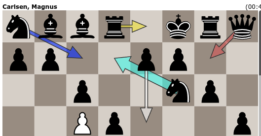
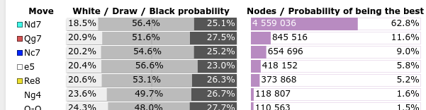
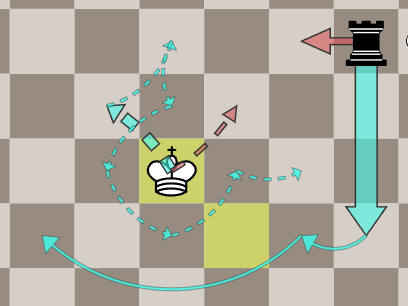
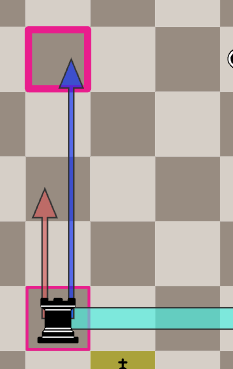
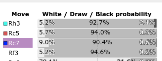

We are excited to announce the launch of https://live.lczero.org/ for the upcoming
World Chess Championship 2024 between Ding Liren and Gukesh Dommaraju.
On this site, you’ll be able to follow real-time annotations of the matches powered by the LCZero engine.

<!--more-->

As you may know, there is a similar site https://analysis.sesse.net/ that provides real-time analysis of the games using Stockfish.
We'd like to showcase the distinctive features of LCZero that allow us to provide more insights into the games, for example:

* Showing probabilities of every game outcome (white wins, black wins, draw), rather than just a single centipawn evaluation.
* Showing the evaluation and probability of each move being played by the players, rather than just the best move.

The WCC games will start on November 25th.
Inbetween the games, we may run the annotation of TCEC games just to keep the engine running and to provide some entertainment for the viewers.

---

### Making sense of all the arrows

* Variations starting with different moves are displayed in distinct colors, with thicker lines representing more likely variations.
  * For each variation, you'll see the probability of each outcome (white win, black win, draw) and the likelihood of that move being the best choice.
  
  

* Within each variation:
    * Solid lines represent moves by the player whose turn it is.
    * Dashed lines indicate the opponent's moves.
    * When the same piece moves consecutively within a variation (as in a maneuver), these moves are shown with thin lines.
      

* When reviewing previous moves, the move that was actually played is highlighted with a pink outline and a lavender background:
  
  

* You can click on a variation to explore it move by move.

### Technical details

The analysis is done on the following hardware:

* 4 x RTX 4090 GPUs
* AMD EPYC 7502 32-Core Processor
* 512 GB RAM
* Network running is BT4-1024x15x32h-swa-6147500.

The probabilities will be [adjusted](/blog/2023/07/the-lc0-v0.30.0-wdl-rescale/contempt-implementation/) by the players' ratings.
Additionally, the player ratings will be adjusted by the clock time remaining:

$$ additional\_elo = 50 \times log_2 \frac{average\_move\_time}{10} $$

We’re hopeful it’ll manage the traffic smoothly, although we're uncertain about how much popularity to expect.