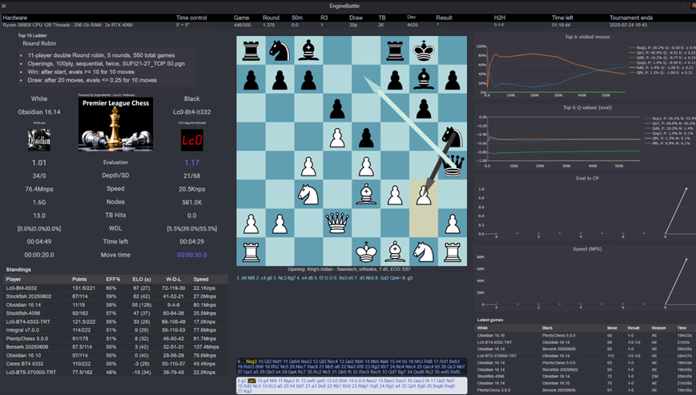
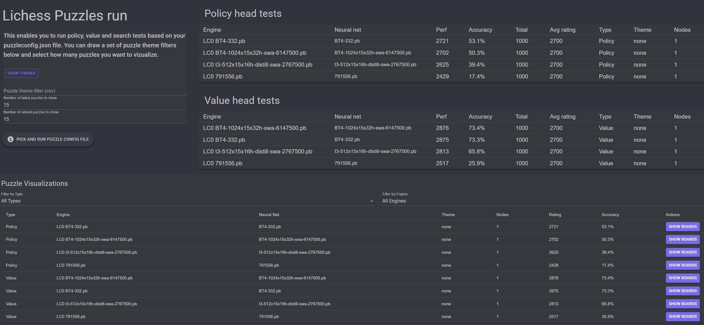
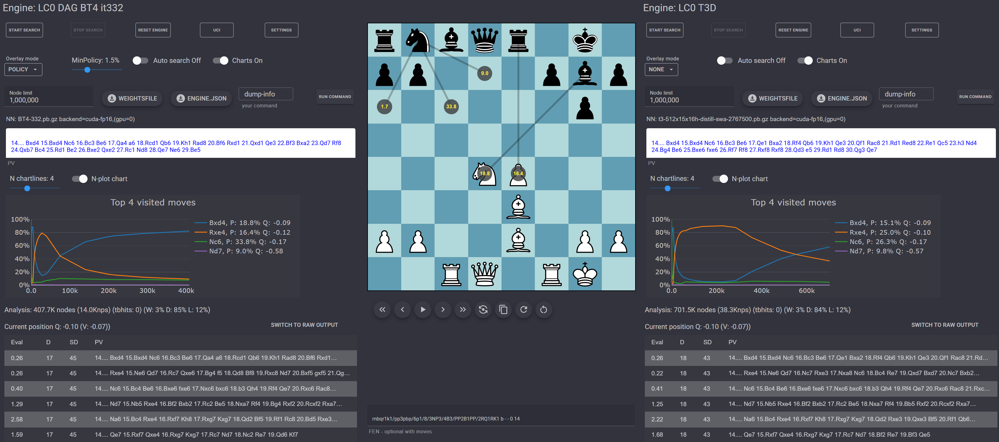

The chess engine development community has always needed powerful tools to test, analyze, and compare engine performance. EngineBattle offers a comprehensive solution specifically designed with features that make it invaluable for Lc0 developers and users who want to dive deep into neural network evaluation and testing.

<!--more-->

## What is EngineBattle?

EngineBattle is a modern, web-based chess engine testing platform that supports tournaments, puzzle testing, detailed analysis, and real-time visualizations. What sets it apart for Lc0 users is its specialized support for Monte Carlo Tree Search (MCTS) engines, offering unique insights into how neural networks evaluate positions and make decisions.

The tool is available as an open-source project on [GitHub](https://github.com/lepned/EngineBattle) and is actively being developed for the chess engine community, with a newly created [Discord server](https://discord.gg/tRMYTbk5TE) for users and contributors.



## Key Features for the Lc0 Community

### Real-Time Search Visualization

One of EngineBattle's standout features is its live visualization of search internals. The tool provides two specialized charts that are particularly valuable for Lc0 search analysis:

- **N-Plot Chart**: Displays the top moves by nodes visited (%) during search, along with Q-values and policy probabilities. If the top policy move isn't among the most visited moves, it's highlighted in red, revealing potential policy-search disagreements.

- **Q-Plot Chart**: Shows moves ranked by Q-value (evaluation) with corresponding node visit percentages and policy values. This helps identify when the value head and policy head disagree on move evaluation.

These visualizations are invaluable for network developers who need to understand how their engine makes decisions during play and analysis. These charts are based on LogLiveStats output from Lc0 and Ceres.

### Specialized Testing Modes

EngineBattle offers several testing modes particularly useful for Lc0:

**Policy Head Testing**: Configure node-limited games (even single-node searches) to test pure policy network performance. This is perfect for evaluating how well the policy head performs without value head influence or search.

**Value Head Testing**: Test the value network's accuracy by comparing evaluations across different positions, helping identify areas where the value head might need improvement.

**Combined Evaluation**: Run comprehensive tests that examine both policy and value head performance simultaneously with search.

## Practical Examples for Lc0 Testing with Lichess Puzzles

### Example 1: Policy and Value Network Testing

EngineBattle's integration with Lichess puzzles makes it ideal for testing policy networks and value networks in isolation. To set up such a test, configure your PuzzleConfig.json file:

```
{
  "PuzzleFile": "C:/Dev/Chess/Puzzles/lichess_db_April_2025.csv",
  "Type": "policy, value",
  "MaxRating": 2500,
  "MinRating": 1500,
  "RatingGroups": "1500, 2000, 2500",
  "PuzzleFilter": "mateIn3, exposedKing, doubleCheck",
  "EngineFolder": "C:/Dev/Chess/Engines/EngineDefs",
  "Engines": [
    {
      "Engine": {
        "ConfigName": "Lc0Def.json",
        "Nodes": 0
      }
    }
  ],
  "SampleSize": 1000,
  "Nodes": "",
  "Concurrency": 2,
  "FailedPuzzlesOutputFolder": "C:/Dev/Chess/Puzzles/FailedPuzzles"
}
```

Adjust the paths to PuzzleFile, EngineFolder and FailedPuzzlesOutputFolder to your own setup and OS. This configuration tests the policy network with single-node searches (pure policy evaluation) and the value network across 1000 puzzles rated between 1500-2500, focusing on tactical themes like mate-in-3 and exposed king patterns. The results show how well the heads alone can solve tactical puzzles without search tree expansion.

### Example 2: Testing Multiple Networks with EngineWithNets

For comprehensive network evaluation across multiple neural networks using the EngineWithNets configuration:

```
{
  "PuzzleFile": "C:/Dev/Chess/Puzzles/lichess_db_April_2025.csv",
  "Type": "policy, value, search",
  "MaxRating": 3500,
  "MinRating": 1200,
  "RatingGroups": "1600, 2000, 2400, 2800",
  "PuzzleFilter": "",
  "EngineFolder": "C:/Dev/Chess/Engines/EngineDefs",
  "Engines": [
    {
      "EngineWithNets": {
        "ConfigName": "Lc0Def.json",
        "Nodes": 0,
        "ListOfNetsWithPaths": [
         "C:/Dev/Chess/Networks/791556.pb.gz",          
         "C:/Dev/Chess/Networks/t3-512x15x16h-distill-swa-2767500.pb.gz",
         "C:/Dev/Chess/Networks/BT4/BT4-332.pb.gz",
         "C:/Dev/Chess/Networks/BT4/BT4-1024x15x32h-swa-6147500.pb.gz" ] 
      }
    }
  ],
  "SampleSize": 2000,
  "Nodes": "10, 100",
  "Concurrency": 2,
  "FailedPuzzlesOutputFolder": "C:/Dev/Chess/Puzzles/FailedPuzzles"
}
```

This comprehensive test evaluates multiple networks across all test types (policy, value, search) with varying node counts and a large sample size for statistical significance. It's worth mentioning that this specific feature was used to determine the strength of modern Lc0 networks compared to AlphaZero like networks and DeepMind's latest transformer network in this blog post: https://lczero.org/blog/2024/02/how-well-do-lc0-networks-compare-to-the-greatest-transformer-network-from-deepmind/

#### Lichess puzzle run with different Lc0 nets



The puzzles can be visualized for each engine with a **Show Boards** button that allows users to examine both solved and failed puzzles, providing visual insight into where the engine succeeded or made errors. Puzzle testing can also be performed directly from the console for automated workflows.

#### Results Analysis and Interpretation

After running puzzle tests, EngineBattle generates comprehensive results:

- **Rating-based performance**: See how networks perform across different puzzle rating ranges
- **Theme-based analysis**: Understand which tactical patterns each network handles well
- **Node scaling**: Observe how performance improves with increased search depth
- **Comparative statistics**: Direct comparison between different networks or engine versions
- **Failed puzzle output**: Detailed analysis of missed puzzles with visual board representations

The tool automatically saves failed puzzles to your specified output folder, allowing you to later load and visualize them in the GUI using Tools > Test Canvas for detailed analysis of where each network struggles.

## Advanced Features for Developers

### Dual Analysis Mode with advanced search visualization

EngineBattle's analysis mode provides an intuitive interface for position analysis with specialized support for engines like Lc0 and Ceres. The dual-engine analysis feature allows you to compare two engines simultaneously, making it perfect for evaluating different networks or configurations side-by-side. Configure your AnalyzeConfig.json to specify two Lc0 engines with different networks, set your desired node count, and load any position to see real-time evaluation differences and search visualization charts. This is particularly valuable when testing experimental search features against defaults across different test positions.

#### Dual analysis mode with Lc0 with two different nets


Analysis mode lets you choose between different overlay modes (policy, Q-value, V-value, E-value, etc.) for engines that support LogLiveStats UCI output, providing detailed real-time insights into neural network evaluation components. This overlay feature was inspired by the Nibbler GUI.

### Tournament Mode

EngineBattle's tournament system includes several features beneficial for Lc0 testing:

- **Prevent Move Deviation**: Ensures engines make consistent moves across different games when they encounter the same position, crucial for a more reliable testing of engines and networks
- **Asymmetric Time Controls**: Configure different time/node limits per engine, useful when comparing networks/engines of different strengths
- **Intra-tournament Engine Addition**: Add new engines to ongoing tournaments for continuous match-play.
- **Node-Limited Matches**: Conduct node-limited games perfect for policy tests with single-node searches

### Console Mode for High-Throughput Testing

The console mode supports parallel game execution and puzzle testing, perfect for:
- Rapid policy testing across multiple games
- High-volume network comparisons
- Automated regression testing of new builds
- Concurrent puzzle solving with configurable concurrency levels

## Getting Started with Lc0 Testing

Getting started with EngineBattle is straightforward:

1. **Installation**: Clone the repository and run `dotnet run -c release` from the WebGUI folder
2. **Configuration**: Create your Lc0Def.json file specifying your Lc0 binary, weights, and parameters. See Enginebattle readme for an example of this
3. **Puzzle Setup**: Download Lichess puzzle databases and configure your PuzzleConfig.json
4. **Testing**: Start with focused puzzle testing to evaluate specific network capabilities

EngineBattle requires .NET 9.0 or later and runs on Windows, Linux, and macOS; comprehensive documentation is available in the repository, and videos and tutorials showcasing its features will be coming soon on the EngineBattle Discord channel.

## Community Impact and Usage

EngineBattle provides comprehensive tools for neural network analysis, from real-time search visualization to extensive puzzle testing. Whether you're developing networks, conducting research, or creating content, it offers the depth and flexibility needed for meaningful chess engine evaluation.
