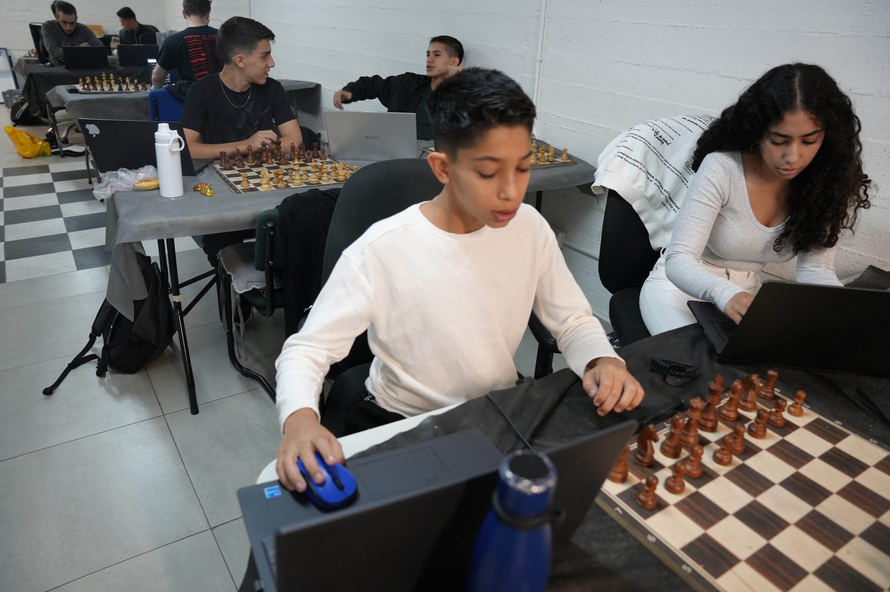
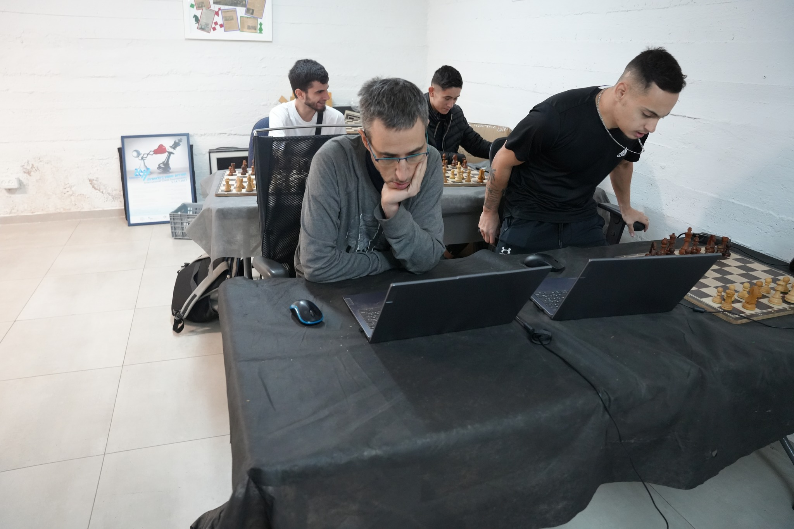

Is a rook advantage enough for a master to beat a superhuman AI in classical chess? For decades, the answer was an obvious "yes." However, a recent event in Jerusalem suggests the answer is no longer guaranteed.

<!-- more -->

On November 29, a Classical time limit (90'+30") match took place on Lichess between 19 strong human players meeting at the Jerusalem Club in Israel and the LeelaOddsBots (mostly LeelaRookOdds). There was prize money for wins and draws to ensure that the players would play seriously, while also ruling out cheating, making this a much stricter test than typical online play. A similar event was held several years ago when the computer was Komodo and the handicap was knight odds; both of these events were organized and partly funded by Uri Blass.

### The Setup and The Hardware

The match was a double-round event. This was practical because Leela was playing at blitz speed, so games rarely exceeded two hours.

- **Round 1:** Mostly Rook odds (Leela White with the a1 rook removed), with two lower-rated players receiving two-knight odds.
- **Round 2:** Rook odds again, except for first-round winners (who moved to knight odds) and one loser (who moved to two-knight odds).

LeelaRookOdds, running on my home computer with a **5090 GPU**, played up to 12 games at once with replacement as games finished. The remaining games ran on my older 4090 GPU computer.

The humans generally played on real chess boards, entering their moves online only when ready. This led to very few errors, the only significant one at rook odds being a player entering a wrong move just as he was about to force a draw by repetition, we adjuticated this to a draw for the tournament.

### The Human Field

There were 38 games in total, 31 of which were at rook odds. The rook-odds players ranged from 1900 FIDE up to a 2463 FIDE IM, Yannay Ben Ari. The field was notably young; 12 of the 17 rook-odds players were between the ages of 12 and 23, suggesting the field was likely underrated compared to their official FIDE metrics.

The roster included:

- 2 International Masters (IMs)
- 3 FIDE Masters (FMs)
- 4 National Masters (NMs)

### Rook Odds: Results and Performance

The performance of LeelaRookOdds was staggering given the handicap.

| Category | Games | Leela Wins | Draws | Human Wins | Leela Perf. Rating |
| :--- | :---: | :---: | :---: | :---: | :---: |
| All Rook Odds | 31 | 18 | 8 | 5 | 2321 |
| vs Titled Players (2150+) | 17 | 9 | 5 | 3 | 2417 |

Based on the average FIDE rating of the field (2166), Leela achieved a performance rating of 2321. Since the FIDE requirement for the FM title is to play 30 games with a rating of at least 2300, we can unofficially say **LeelaRookOdds has "earned" the FM title** - despite playing at blitz speed, in a simul on a single GPU, and starting without a rook!

Interestingly, performance rose with the rating of the opposition. Against the nine titled players (NM, FM, IM), Leela performed at an IM level (2417). This phenomenon is normal for the LeelaOddsBots. Leela "assumes" the opposition is strong enough to score 50% at the odds, so she often allows early draws by repetition if the opening goes well for the human. Weaker players accept these draws, while stronger players fight on.

### Analysis: How Leela Wins (and Loses)

The five human wins were high-quality games. Leela successfully complicated positions, but the humans found clever ways to simplify into winning endgames. One featured a prolonged battle to convert a Queen-for-Rook advantage with opposite-colored bishops, which was ultimately indefensible for Leela.

Conversely, the 18 games won by Leela were decided by complex tactics. These were rarely obvious blunders, but rather deep complications that master-level players can usually spot given enough time. However, Leela keeps the board so chaotic that humans eventually overlook something, either due to complexity or time pressure.

**The Accuracy Requirement:**
I checked the Lichess accuracy figures (using Stockfish 17.1) for the humans and found the results surprising:

- **No one won** a game with less than **97% accuracy**.
- Some losses had accuracy as high as **90–92%**.
- Some draws had accuracy up to **94%**.

It turns out that winning a game starting with an extra rook requires near-perfection. Leela gradually reduces the disadvantage until one serious error makes the game close, then usually wins via further small errors.

### Knight and Two-Knight Odds Results

The results for minor piece handicaps were mixed, partially due to sample size.

| Handicap | Opponent | Result |
| :--- | :--- | :---: |
| **Knight Odds** | IM (Top Rated) | **Leela Win** |
| **Knight Odds** | Y. Gurevich (2081) | **Leela Win** |
| **2-Knights Odds** | Various | **+1 =3 -1** |

*Note: One of the draws in the 2-Knights category was due to a computer crash in a position that was objectively drawn but likely too difficult for the human to hold.*

The performance rating at two knights was only 1743 (or 1813 if we count the crash as a win). This is surprisingly low compared to blitz/rapid data, likely because three of the five games were against underrated junior players (aged 12-13). I suspect against established adults, the break-even for two-knight odds is closer to 2000.

The win against the top IM at knight odds confirms our belief that the break-even point in classical chess for knight odds is in the strong GM range (approx. 2600 FIDE).

### Re-evaluating Handicap Values

Based on this event, I would argue that rook odds is closer to knight odds than it is to two-knight odds. The nominal 3-3-5-9 piece values are endgame values and aren't relevant to the initial position.

In round numbers, if removing the "f" pawn is a value of **1**, here is how I estimate the current handicaps:

- **Knight Odds:** ~3.0
- **Bishop Odds:** ~3.5
- **Rook Odds:** ~4.0 (perhaps slightly more)
- **Queen Odds:** ~8.0

Our experience shows Leela performs much better giving Queen odds than two rooks, though this may change once we have a net specifically trained for two-rook odds.

### Comparison: Classical vs. Blitz

This event allows us to compare human performance at Classical controls against their performance at Blitz vs Leela.

I analyzed LeelaRookOdds' blitz results since the major upgrade in February 2025 against identified GMs in the world top 50. Most games were 3'2" (adjusted for ratings).

| Format | Avg Opponent Rating | Leela Score | Perf. Rating |
| :--- | :---: | :---: | :---: |
| **Blitz (3'2")** | 2714 | +39 =11 -9 | **2909** |
| **Classical (90'30")** | 2166 | +18 =8 -5 | **2321** |

For rook odds at a high human level, the difference in quality of play between 3'2" blitz and 90'30" classical chess appears to be about **600 Elo**. Since standard estimates for this gap are usually around 500 Elo, it seems that odds play increases the divergence between classical and blitz performance.

### Technical Progress and Future Outlook

In the past year, we have made rapid progress with search, but very little with the actual neural nets. LeelaRookOdds still uses **LKO4** (trained by Marcus98 one year ago), which handles Knight, Bishop, Rook, and FRC Knight odds. It has yet to be surpassed.

However, I expect we will soon figure out how to create better odds nets, and that net improvement will exceed search improvement in the coming year. We also hope to gain strength by adjusting search contempt values.

### Conclusion: What is a Fair Match?

Thanks to Uri Blass and everyone involved in organizing this event, we have clarified where the odds bots stand in Classical chess. Based on this data, here are my estimates for a fair match (50% score) at Classical time limits:

- **Rook Odds:** Par with an **IM (~2400 FIDE)**.
- **Knight Odds:** Par with a **Strong GM (~2600 FIDE)**.
- **FRC (Fischer Random):** Add ~100 Elo to the above requirements.
- **Fast Classical (45'30"):** Add ~100 Elo to the above requirements.
