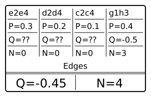
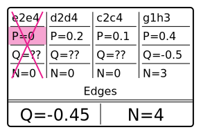
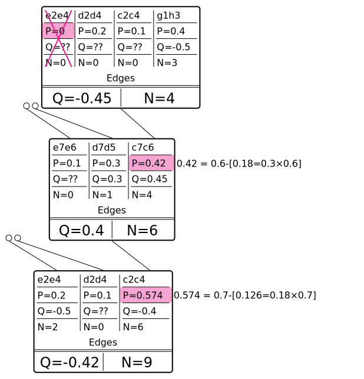

Of all optimization ideas and attempts, improving batch gathering is the main one which stops us from scaling to many GPUs, and it's the area where I (crem) had the most attempts, and all of them failed so far.

All in all, currently we are only able to gather batches of up to ≈1200. Various ideas (different virtual loss approaches, allowing up to 10'000'000 collisions, tree detaching etc) only could raise it to ≈1800. Something completely different is needed. My current thoughts are written below.

## Visits gathering in waves

This is an optimization which is also possible to apply to the current code, quite orthogonal to other stuff on that page.

Currently we gather visits one by one, from root to the leaf.
As during the gathering we don't pass any information back towards parent (except for out-of-order eval), it's possible to do the following.

(suppose our batch size is 256)
* In a loop distribute all 256 visits among children.  
  There is a faster way to that than just one by one: keep U+Q in a heap, and also it's possible to compute how many visits left before the "leader" changes.
* Recursively call gathering in children with corresponding visits budget.
* If some visits hit collisions, sum such visits up and call gathering from root with this batch size.
* After X iterations give up and eval what you have.
* *(with out-of-order or terminal hit it's a bit more complicated though)*

## Simulating illegal moves on collisions

As I wrote, virtual loss doesn't help to prevent collisions. Apparently other nodes are so much worse that even after 10'000'000 collisions, visits don't start to gather new nodes.

But what if all the moves leading to "currently busy" nodes were illegal? Then the search algorithm would have to pick different ones. So, let's try to pretend they were illegal.

### Idea

The idea is to simulate that, behave like that move was always illegal, even during training.

So, suppose we have a node:  

This node was visited 4 times, all children visits went to the move **g1h3**. And now the next visit goes to **e2e4**, which is the first visit ever, so we have to send that position to NN for eval:  

What we can do for the next visits is to pretend that the move was not legal at all and setting it's **P** to **0**.  

It may make sense also to renormalize all other **P**, although I'm not sure how much of a performance hit it would be.  

Note that with this approach we don't need **N-in-flight** anymore, although it's being replaced by much heavier logic. Also note that we don't need to adjust parent's **N** or **Q** in any way as the locked node always has 0 visits.

So far so good, but this alone is not that useful, if it only works for parents of locked nodes. E.g. this tree  
  
would become something like this:  

Obviously, that's not what we'd like and not what would happen if marked moves would be illegal during the training. However, we can develop this idea further, and propagate the probability of the variation back to the parent. I.e. this tree:

  
would have **P**s updated this way:  
  

### Implementation

### Why

### Problems/thoughts
