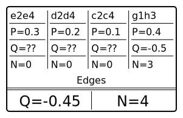
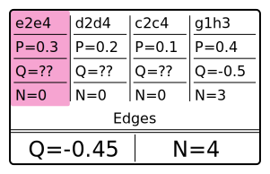
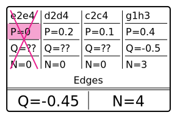
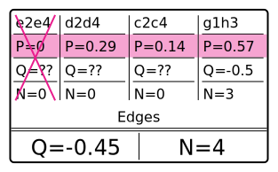
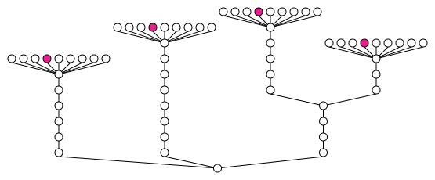
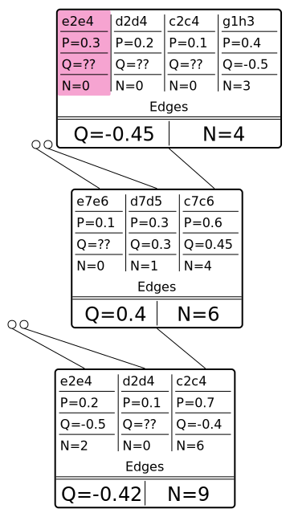
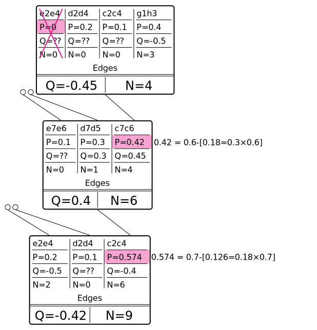

Of all optimization ideas and attempts, improving batch gathering is the main one which stops us from scaling to many GPUs, and it's the area where I (crem) had the most attempts, and all of them failed so far.

All in all, currently we are only able to gather batches of up to ≈1200. Various ideas (different virtual loss approaches, allowing up to 10'000'000 collisions, tree detaching etc) only could raise it to ≈1800. Something completely different is needed. My current thoughts are written below.

## Visits gathering in waves

This is an optimization which is also possible to apply to the current code, quite orthogonal to other stuff on that page.

Currently we gather visits one by one, from root to the leaf.
As during the gathering we don't pass any information back towards parent (except for out-of-order eval), it's possible to do the following.

(suppose our batch size is 256)
* In a loop distribute all 256 visits among children.  
  There is a faster way to that than just one by one: keep U+Q in a heap, and also it's possible to compute how many visits left before the "leader" changes.
* Recursively call gathering in children with corresponding visits budget.
* If some visits hit collisions, sum such visits up and call gathering from root with this batch size.
* After X iterations give up and eval what you have.
* *(with out-of-order or terminal hit it's a bit more complicated though)*

## Simulating illegal moves on collisions

As I wrote, virtual loss doesn't help to prevent collisions. Apparently other nodes are so much worse that even after 10'000'000 collisions, visits don't start to gather new nodes.

But what if all the moves leading to "currently busy" nodes were illegal? Then the search algorithm would have to pick different ones. So, let's try to pretend they were illegal.

### Idea

The idea is to simulate that, behave like that move was always illegal, even during training.

So, suppose we have a node:  

This node was visited 4 times, all children visits went to the move **g1h3**. And now the next visit goes to **e2e4**, which is the first visit ever, so we have to send that position to NN for eval:  

What we can do for the next visits is to pretend that the move was not legal at all and setting it's **P** to **0**.  

It may make sense also to renormalize all other **P**.  

Note that with this approach we don't need **N-in-flight** anymore, although it's being replaced by much heavier logic. Also note that we don't need to adjust parent's **N** or **Q** in any way as the locked node always has 0 visits.

So far so good, but this alone is not that useful, if it only works for parents of locked nodes. E.g. this tree  
  
would become something like this:  

Obviously, that's not what we'd like and not what would happen if marked moves would be illegal during the training. However, we can develop this idea further, and propagate the probability of the variation back to the parent. I.e. this tree:

  
would have **P**s updated this way:  
  

### Implementation

I didn't try to implement this yet, but my plan for the first attempt is:

* Don't modify **P** in nodes. Instead have a separate tree data structure to override values of **P**.
    * On collision add entire path from root to the leaf with **P** adjustments.
    * Before sending a "wave" (described in previous section), join all such paths to a tree. When propagating "wave" recursively, pass a subtree.
* Don't do that **P=0** when sending a node to eval, so that on collision instead.
    * This is more transposition-friendly, as multiple paths can lead to the same node.
    * It allows to clear the data structure at arbitrary moments of time (e.g. when some nodes finish NN evaluation), and nothing breaks.
    * But it adds more unnecessary node gathering passes to rebuild that tree structure.
* When any of NN batches finish evaluation, clean entire structure (which includes nodes for which evaluation is still in progress). Wasteful but easy, will do that in first prototype.
* If this scheme fails (e.g. we somehow get into the node where all child nodes are already with P=0), skip the eval. E.g. when there are only 20 nodes in entire tree (first few iterations), there's no theoretical way to build large batches.
* The renormalization is also simple. Nothing has to be updated in Nodes structure, do that on the fly.
* The "working tree" structure will be relatively small (O(depth × nodes_in_flight)), it may probably be designed to be a cache friendly.

### Why

Why is all that needed?

* Main reason: we need huge batches (10000 or more), and all "hacky" ways to gather them failed.
* It does seem like a "correct" way to solve it, rather than "hacky" virtual loss-related ways.

### Problems/thoughts

* Performance may be a bottleneck.
* Updating and using the structure must not hinder parallelization.