Various stats from the Lc0 participation at WCCC in 2022.

## Logs location

The logs can be found [here](http://data.lczero.org/wccc-logs/wccc-2022-lc0-logs.tar.bz2).

## Per game stats

### Legend

Images are possible to open in new tab and zoom in.

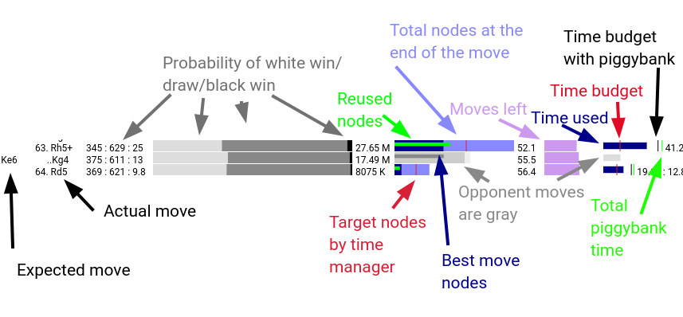

### WCSC

Round 1
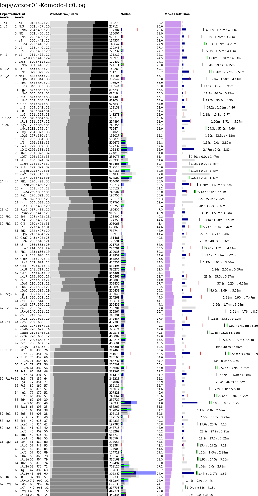

Round 2
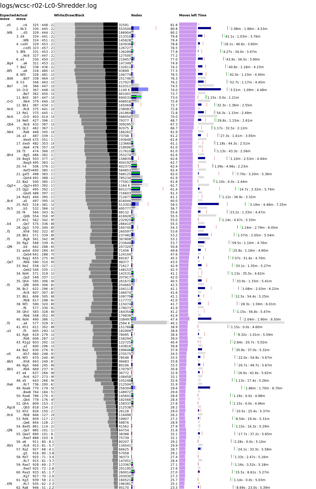

Round 3
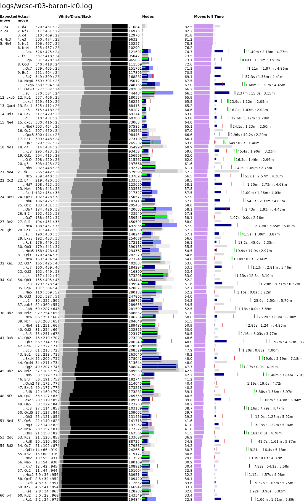

Round 4
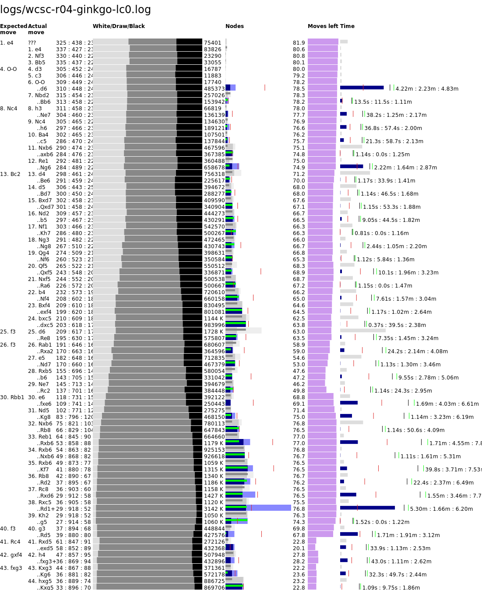

Round 5

Round 6
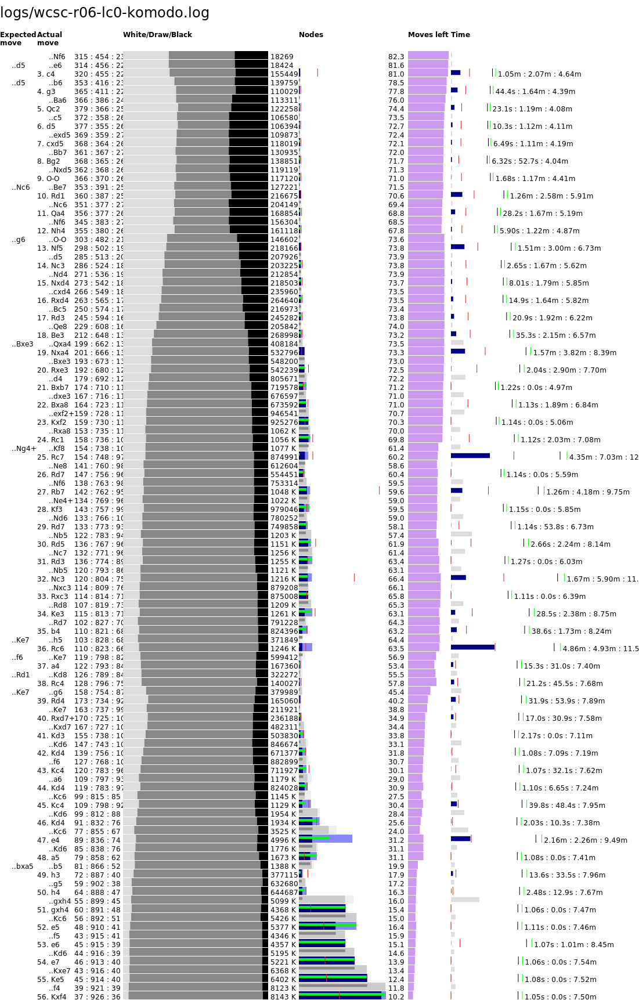

(logs for round 7 are lost :-( )

Round 8

Round 9

Round 10
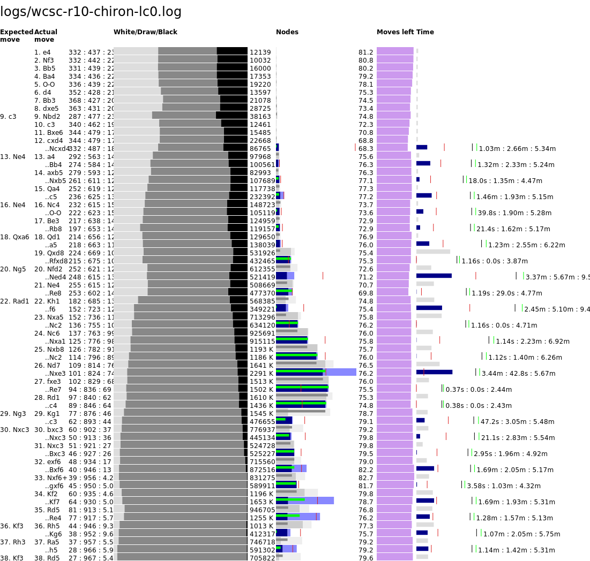

### WCCC

Round 1
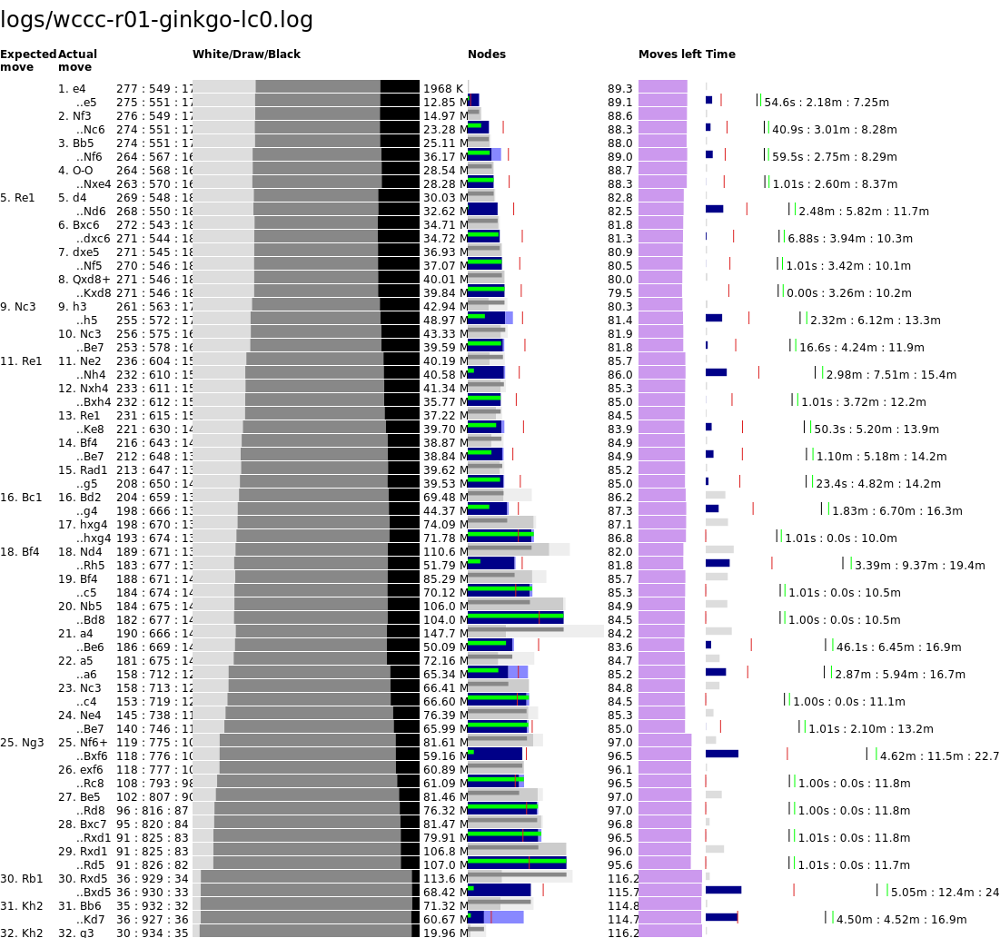

Round 2

Round 3
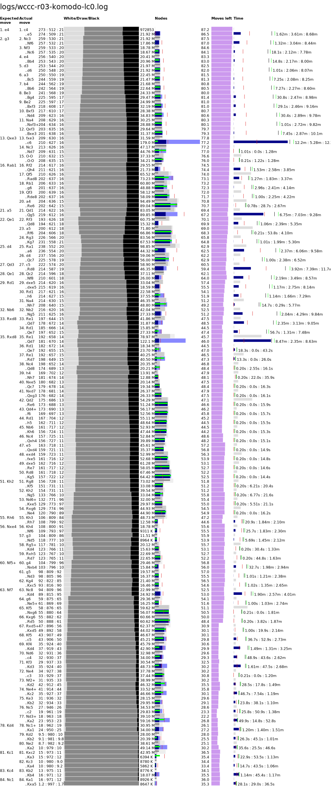

Round 4

Round 6

Round 7
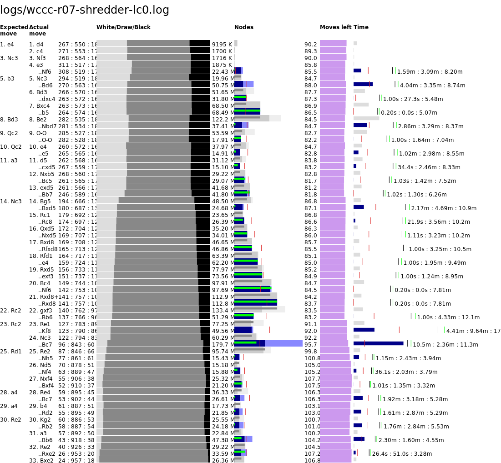

Round 8

Round 10

Tie-break game 1
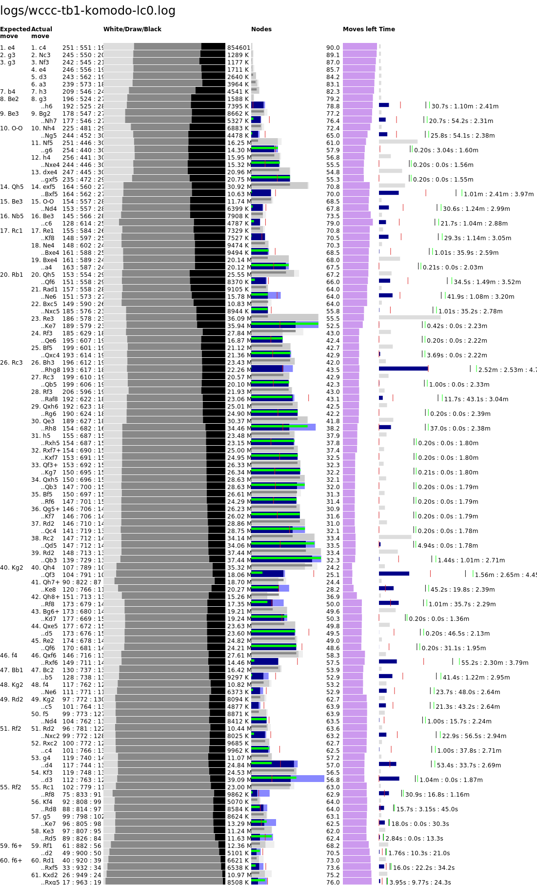

Tie-break game 2

Tie-break game 3

Tie-break game 4

Armageddon

### WCSCC

Round 1

Round 2

Round 3

Round 4

Round 5
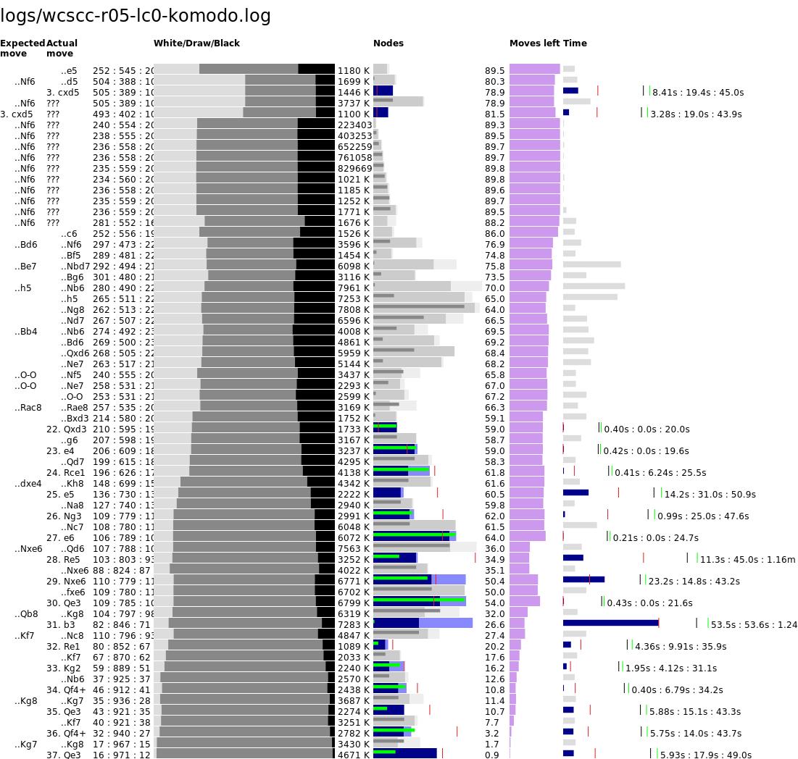

Round 5
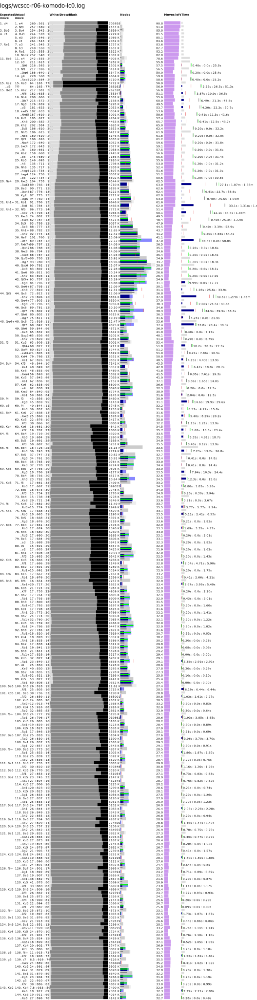
