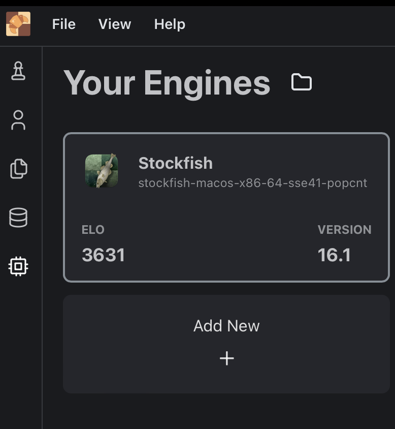
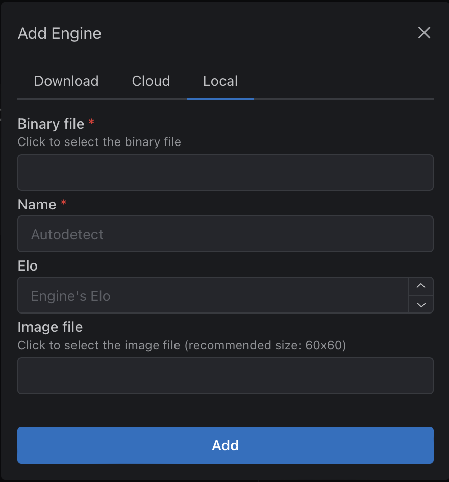
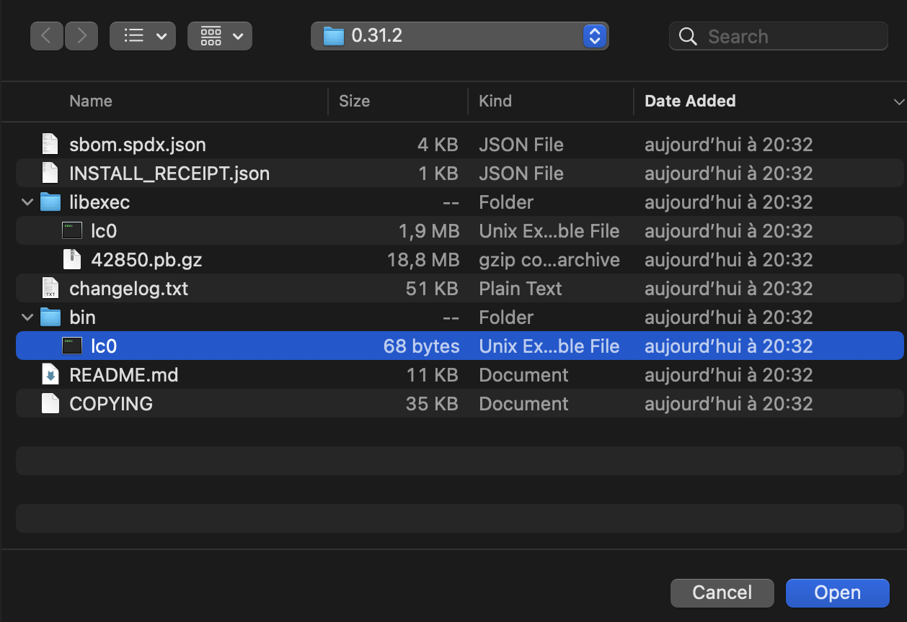

# 1. On Windows
The LC0 engine is available on Windows. In the application, go to Engines and then select LC0.

# 2. On macOS
## 2.1 Locate the engine
Follow the instructions to install lc0 with Homebrew in the "Download Lc0" section.

After installation, locate your engine with the command:
```
brew info lc0
```

The command should give you the path where the Lc0 engine is located.
For example:
```
Installed
/opt/homebrew/Cellar/lc0/0.31.2
```

## 2.2 Add it to En Croissant

Take a coffee break, then launch En Croissant.

### Step 1 - Add an engine
Go to Engines, and then click "Add New"

### Step 2 - Select the engine file

- Go to the Local tab.
- Click on "Binary file".

A Finder window should open to let you choose where the engine is installed.

On macOS, the `/opt/homebrew/` directory is a system-level directory that's hidden by default in Finder.

To locate the engine and use it:
- In Finder, press `Cmd + Shift + G` (or go to Go menu → Go to Folder) to browse to a specific path
- Copy and paste the path of the engine (see section 2.1)
- The file to select is located in the `bin` folder
- Select the file `lc0` (located at `bin/lc0`)

### Step 3 - Launch a game or analysis
Create a game and select the lc0 engine, or launch the analysis board with lc0.

### Detailed steps with pictures

#### Step 1


#### Step 2


#### Step 3
