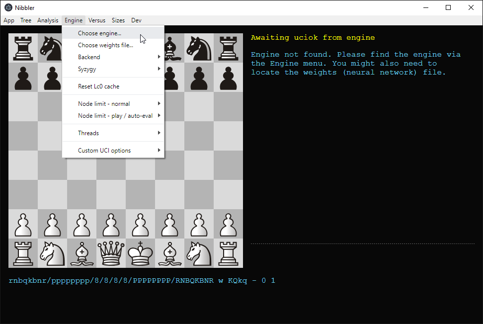
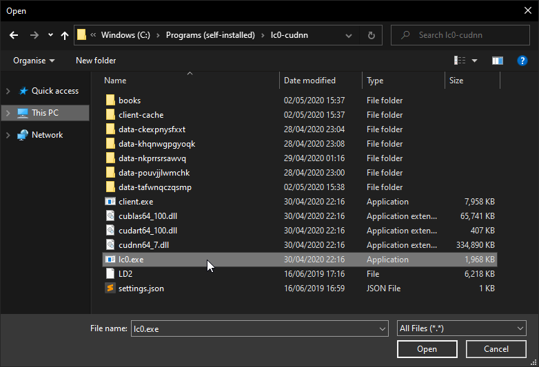
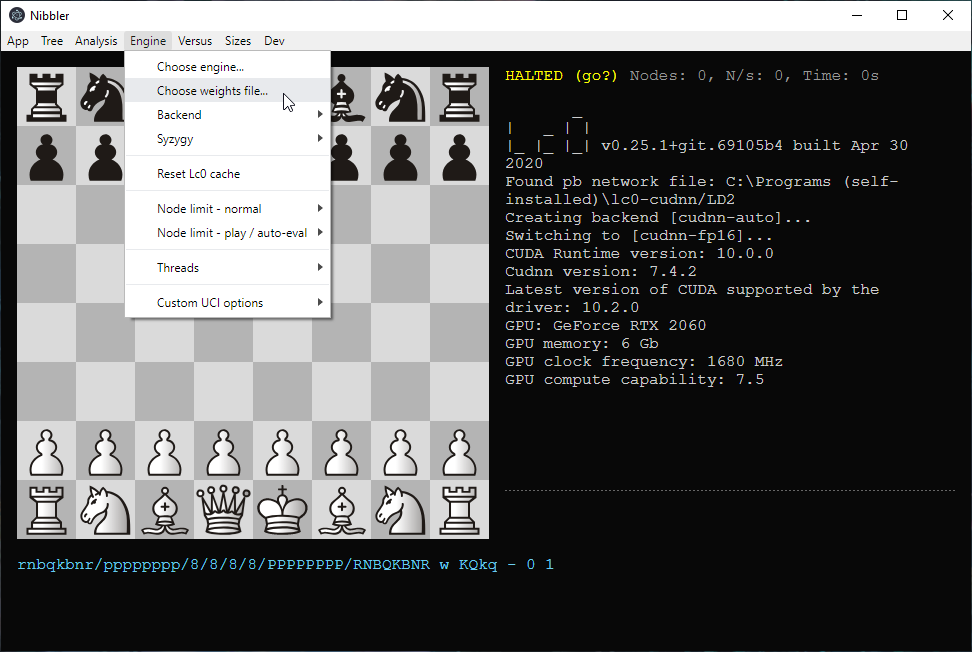
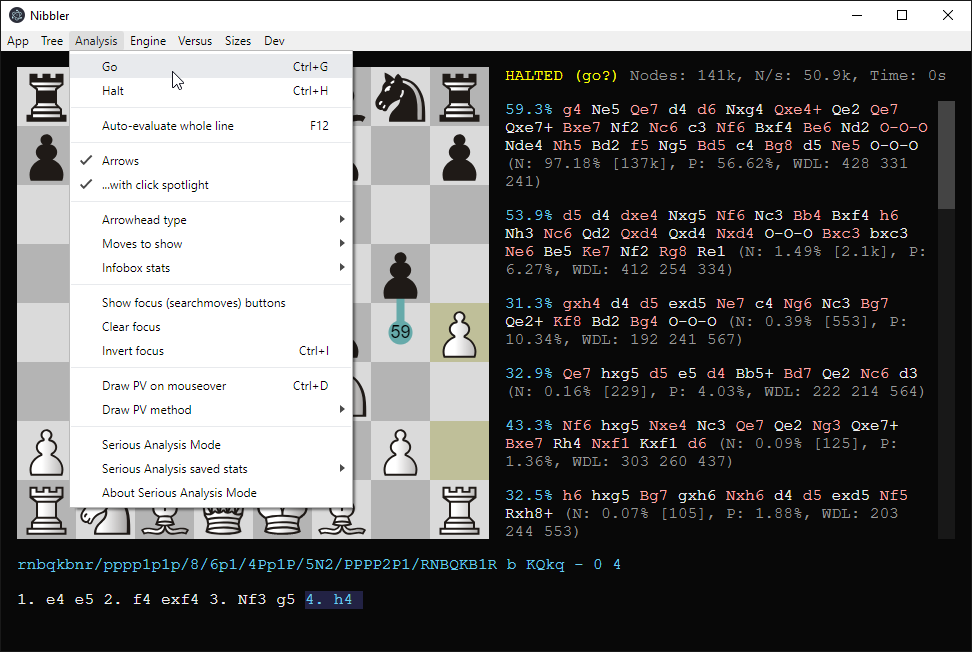
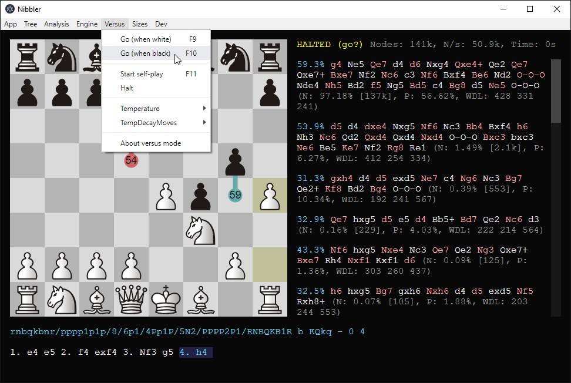

To install Lc0 in Nibbler, follow the following steps:

1. Go to Engine → Choose engine...

2. In the dialog that appeared, find and select your **lc0.exe** file.

3. (optional) If you'd like to select a specific weights file, use Engine → Choose weights file...

4. The engine is now usable! Nibbler is an analysis tool first and foremost. To run analysis on the current position, press Control-G (or select Analysis → Go). To halt the analysis, press Control-H (or select Analysis → Halt).

5. Various other ways of using Nibbler exist. For example, it is possible to play against Leela by selecting Versus → Go (when White | Black). The strength can be altered by adjusting the number of nodes Leela uses, at Engine → Node limit - play / auto-eval.

